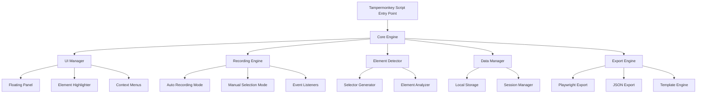
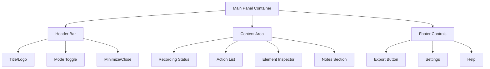
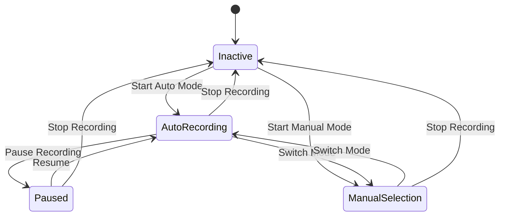
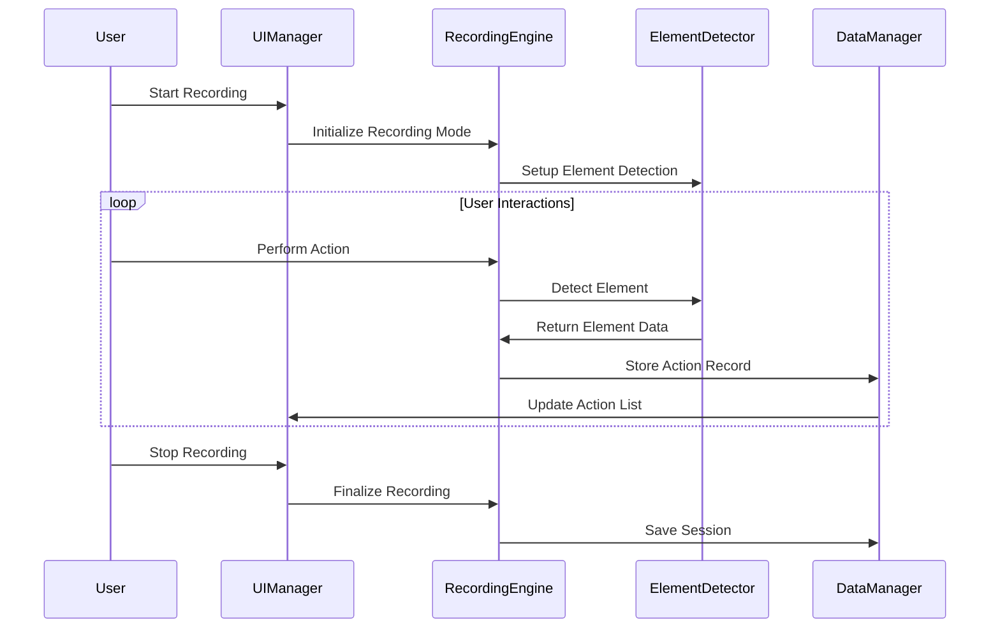
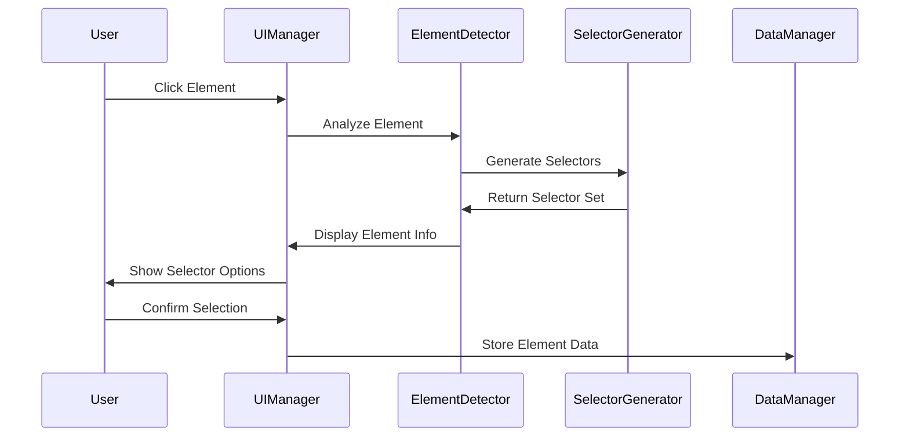
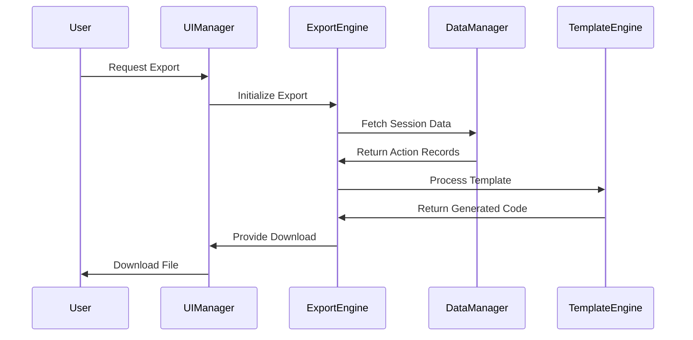

# Enscriber - Tampermonkey Playwright Automation Tool Architecture

## Project Overview
Enscriber is a Tampermonkey script that helps developers record website interactions for Playwright script generation. It serves a mixed audience (beginners to experts) with Chrome-first development and hybrid recording capabilities.

## 1. Overall System Architecture

### Core System Components



### System Architecture Layers

1. **Presentation Layer**
   - Floating UI Panel
   - Element highlighting overlays
   - Context menus and tooltips

2. **Application Layer**
   - Recording state management
   - User interaction handling
   - Mode switching logic

3. **Business Logic Layer**
   - Element detection algorithms
   - Selector generation strategies
   - Action categorization

4. **Data Layer**
   - localStorage persistence
   - Session data management
   - Export/import functionality

5. **Integration Layer**
   - Website DOM interaction
   - Event capture and filtering
   - Non-intrusive injection

## 2. UI Architecture - Floating Panel System

### Panel Structure


### UI Features
- **Draggable**: Click and drag from header bar
- **Resizable**: Resize handles on corners and edges
- **Collapsible**: Minimize to small floating button
- **Dockable**: Snap to screen edges
- **Transparent**: Adjustable opacity when not in focus
- **Z-index Management**: Always on top but respectful

### Responsive Design
- Minimum size: 300x400px
- Maximum size: 800x600px
- Mobile-friendly touch targets
- Keyboard navigation support

## 3. Data Models

### Core Data Structures

#### Action Record
```javascript
interface ActionRecord {
  id: string;
  timestamp: number;
  type: ActionType;
  element: ElementMetadata;
  value?: string;
  notes?: string;
  screenshot?: string;
  context: ContextInfo;
}
```

#### Element Metadata
```javascript
interface ElementMetadata {
  selectors: SelectorSet;
  attributes: Record<string, string>;
  textContent: string;
  position: DOMRect;
  tagName: string;
  isVisible: boolean;
  computedStyles: Partial<CSSStyleDeclaration>;
}
```

#### Selector Set
```javascript
interface SelectorSet {
  css: string[];
  xpath: string[];
  dataAttributes: string[];
  textBased: string[];
  role: string[];
  confidence: SelectorConfidence;
}
```

#### Session Data
```javascript
interface SessionData {
  id: string;
  name: string;
  url: string;
  startTime: number;
  endTime?: number;
  actions: ActionRecord[];
  settings: SessionSettings;
  metadata: SessionMetadata;
}
```

## 4. Element Detection Strategy

### Multi-Strategy Selector Generation

#### Priority Order
1. **Data Attributes** (highest reliability)
   - data-testid
   - data-cy
   - data-test
   - Custom data attributes

2. **Semantic Selectors**
   - ARIA roles and labels
   - Form labels
   - Semantic HTML elements

3. **CSS Selectors**
   - ID selectors (if stable)
   - Class combinations
   - Attribute selectors

4. **XPath Selectors**
   - Relative XPath
   - Text-based XPath
   - Position-based XPath (last resort)

5. **Text Content**
   - Exact text match
   - Partial text match
   - Normalized text match

### Selector Confidence Scoring
```javascript
interface SelectorConfidence {
  dataAttribute: number;    // 0.9-1.0
  semantic: number;         // 0.7-0.9
  css: number;             // 0.5-0.8
  xpath: number;           // 0.3-0.7
  textBased: number;       // 0.2-0.6
}
```

## 5. Recording Modes Architecture

### Mode State Management


### Auto Recording Mode
- Captures all user interactions
- Intelligent filtering of noise events
- Real-time action categorization
- Automatic element detection

### Manual Selection Mode
- Click-to-select elements
- Guided action prompts
- Custom note addition
- Selective recording

## 6. Storage Architecture

### localStorage Structure
```javascript
interface StorageSchema {
  sessions: Record<string, SessionData>;
  settings: GlobalSettings;
  templates: Record<string, ExportTemplate>;
  cache: ElementCache;
}
```

### Data Persistence Strategy
- Auto-save every 30 seconds
- Manual save on significant actions
- Export/import capabilities
- Data compression for large sessions
- Cleanup of old sessions

## 7. Component Structure

### Core Components

#### EnscribeCore
- Main application controller
- Mode management
- Event coordination

#### UIManager
- Panel rendering and management
- User interaction handling
- Visual feedback coordination

#### RecordingEngine
- Event capture and processing
- Action classification
- State management

#### ElementDetector
- DOM element analysis
- Selector generation
- Element metadata extraction

#### DataManager
- Storage operations
- Session management
- Data serialization

#### ExportEngine
- Multiple format support
- Template processing
- Code generation

## 8. Cross-Browser Compatibility Strategy

### Chrome-First Development
- Primary development and testing on Chrome
- Use Chrome-specific APIs where beneficial
- Graceful degradation for other browsers

### Progressive Enhancement
- Core functionality works on all browsers
- Enhanced features for supported browsers
- Feature detection over browser detection

### Compatibility Layers
- Polyfills for missing APIs
- Vendor prefix handling
- Event normalization

## 9. Export Format Specifications

### Beginner Level Export
```javascript
// Simple, commented Playwright code
await page.click('[data-testid="login-button"]');
await page.fill('#username', 'user@example.com');
await page.click('text=Submit');
```

### Intermediate Level Export
```javascript
// Page Object Model structure
class LoginPage {
  constructor(page) {
    this.page = page;
    this.loginButton = '[data-testid="login-button"]';
    this.usernameField = '#username';
  }
  
  async login(username) {
    await this.page.click(this.loginButton);
    await this.page.fill(this.usernameField, username);
  }
}
```

### Advanced Level Export
```javascript
// Full test suite with fixtures and utilities
import { test, expect } from '@playwright/test';
import { LoginPage } from '../pages/LoginPage';

test.describe('User Authentication', () => {
  test('should login successfully', async ({ page }) => {
    const loginPage = new LoginPage(page);
    await loginPage.navigate();
    await loginPage.login('user@example.com');
    await expect(page).toHaveURL('/dashboard');
  });
});
```

## 10. Integration Strategy

### Non-Intrusive Design Principles
- Minimal DOM manipulation
- No interference with website functionality
- Isolated CSS and JavaScript
- Event capture without blocking

### Injection Strategy
- Shadow DOM for UI components
- CSS-in-JS for styling isolation
- Namespace all global variables
- Clean event listener management

### Performance Considerations
- Lazy loading of components
- Efficient event delegation
- Memory leak prevention
- Minimal CPU impact during recording

## Next Steps
This architecture provides the foundation for implementing the Enscriber tool. Each component can be developed independently while maintaining clear interfaces and responsibilities.

## 11. Technical Implementation Guidelines

### Development Standards
- **ES6+ JavaScript**: Modern syntax and features
- **Modular Architecture**: ES6 modules with clear dependencies
- **TypeScript Definitions**: JSDoc comments for type safety
- **Code Style**: Consistent formatting with Prettier
- **Testing Strategy**: Unit tests for core logic, integration tests for UI

### File Structure
```
enscriber/
├── src/
│   ├── core/
│   │   ├── EnscribeCore.js
│   │   ├── EventManager.js
│   │   └── StateManager.js
│   ├── ui/
│   │   ├── UIManager.js
│   │   ├── FloatingPanel.js
│   │   ├── ElementHighlighter.js
│   │   └── components/
│   ├── recording/
│   │   ├── RecordingEngine.js
│   │   ├── AutoRecorder.js
│   │   └── ManualRecorder.js
│   ├── detection/
│   │   ├── ElementDetector.js
│   │   ├── SelectorGenerator.js
│   │   └── ElementAnalyzer.js
│   ├── storage/
│   │   ├── DataManager.js
│   │   ├── SessionManager.js
│   │   └── StorageAdapter.js
│   ├── export/
│   │   ├── ExportEngine.js
│   │   ├── PlaywrightExporter.js
│   │   └── templates/
│   └── utils/
│       ├── DOMUtils.js
│       ├── EventUtils.js
│       └── ValidationUtils.js
├── styles/
│   ├── main.css
│   └── components/
├── templates/
│   ├── beginner.js
│   ├── intermediate.js
│   └── advanced.js
└── tampermonkey-header.js
```

### Performance Guidelines
- **Lazy Loading**: Load components only when needed
- **Event Delegation**: Use efficient event handling patterns
- **Memory Management**: Clean up listeners and references
- **Throttling**: Limit high-frequency operations
- **Caching**: Cache expensive computations and DOM queries

### Security Considerations
- **Content Security Policy**: Respect website CSP
- **XSS Prevention**: Sanitize all user inputs
- **Data Privacy**: No sensitive data collection
- **Secure Storage**: Encrypt sensitive configuration data

## 12. Component Interaction Diagrams

### Recording Flow


### Element Selection Flow


### Export Process Flow


## 13. API Specifications

### Core Engine API
```javascript
class EnscribeCore {
  // Initialization
  async initialize(config)
  
  // Mode Management
  setRecordingMode(mode) // 'auto' | 'manual' | 'paused'
  getRecordingMode()
  
  // Session Management
  startSession(name, url)
  pauseSession()
  resumeSession()
  stopSession()
  
  // Event Handling
  addEventListener(type, handler)
  removeEventListener(type, handler)
  emit(event, data)
}
```

### UI Manager API
```javascript
class UIManager {
  // Panel Management
  showPanel()
  hidePanel()
  togglePanel()
  updatePanelContent(content)
  
  // Element Highlighting
  highlightElement(element, options)
  removeHighlight(element)
  clearAllHighlights()
  
  // User Feedback
  showNotification(message, type)
  showTooltip(element, content)
  updateStatus(status)
}
```

### Recording Engine API
```javascript
class RecordingEngine {
  // Recording Control
  startRecording(mode)
  stopRecording()
  pauseRecording()
  
  // Action Processing
  processAction(event, element)
  categorizeAction(action)
  validateAction(action)
  
  // Event Filtering
  shouldRecordEvent(event)
  filterNoisyEvents(events)
}
```

### Element Detector API
```javascript
class ElementDetector {
  // Element Analysis
  analyzeElement(element)
  generateSelectors(element)
  calculateConfidence(selectors)
  
  // Selector Validation
  validateSelector(selector, element)
  testSelectorUniqueness(selector)
  optimizeSelector(selector)
}
```

### Data Manager API
```javascript
class DataManager {
  // Session Operations
  createSession(data)
  updateSession(id, data)
  deleteSession(id)
  getSession(id)
  listSessions()
  
  // Action Operations
  addAction(sessionId, action)
  updateAction(actionId, data)
  deleteAction(actionId)
  getActions(sessionId)
  
  // Storage Operations
  save()
  load()
  export(format)
  import(data)
}
```

## 14. Implementation Roadmap

### Phase 1: Core Foundation (Weeks 1-2)
- [ ] Set up project structure and build system
- [ ] Implement EnscribeCore with basic initialization
- [ ] Create basic UIManager with floating panel
- [ ] Implement fundamental event handling
- [ ] Set up localStorage-based DataManager

### Phase 2: Element Detection (Weeks 3-4)
- [ ] Build ElementDetector with basic selector generation
- [ ] Implement SelectorGenerator with multiple strategies
- [ ] Create element highlighting system
- [ ] Add confidence scoring for selectors
- [ ] Implement selector validation and testing

### Phase 3: Recording Capabilities (Weeks 5-6)
- [ ] Develop RecordingEngine with mode switching
- [ ] Implement AutoRecorder for automatic capture
- [ ] Build ManualRecorder for selective recording
- [ ] Add action categorization and filtering
- [ ] Create recording state management

### Phase 4: UI Enhancement (Weeks 7-8)
- [ ] Complete FloatingPanel with all features
- [ ] Implement draggable and resizable functionality
- [ ] Add element inspector and action list views
- [ ] Create settings and configuration panels
- [ ] Implement responsive design and accessibility

### Phase 5: Export System (Weeks 9-10)
- [ ] Build ExportEngine with template system
- [ ] Create Playwright code generators for all levels
- [ ] Implement multiple export formats
- [ ] Add code optimization and formatting
- [ ] Create export preview and validation

### Phase 6: Polish and Testing (Weeks 11-12)
- [ ] Comprehensive testing across different websites
- [ ] Performance optimization and memory management
- [ ] Cross-browser compatibility testing
- [ ] User experience refinements
- [ ] Documentation and help system

### Phase 7: Advanced Features (Future)
- [ ] Chrome extension version
- [ ] Cloud storage integration
- [ ] Team collaboration features
- [ ] Advanced selector strategies
- [ ] Integration with testing frameworks

## 15. Success Metrics

### Technical Metrics
- **Selector Accuracy**: >95% reliable element detection
- **Performance Impact**: <5% CPU usage during recording
- **Memory Usage**: <50MB for typical sessions
- **Load Time**: <2 seconds for script initialization
- **Cross-browser Support**: Chrome, Firefox, Edge compatibility

### User Experience Metrics
- **Learning Curve**: New users productive within 10 minutes
- **Export Quality**: Generated code requires minimal manual editing
- **UI Responsiveness**: All interactions respond within 100ms
- **Error Rate**: <1% false positive element detections
- **User Satisfaction**: >4.5/5 rating from beta testers

## Conclusion
This comprehensive architecture provides a complete blueprint for implementing the Enscriber tool. The modular design allows for independent development of components while maintaining clear interfaces and responsibilities. The phased implementation approach ensures steady progress with regular deliverables and testing opportunities.